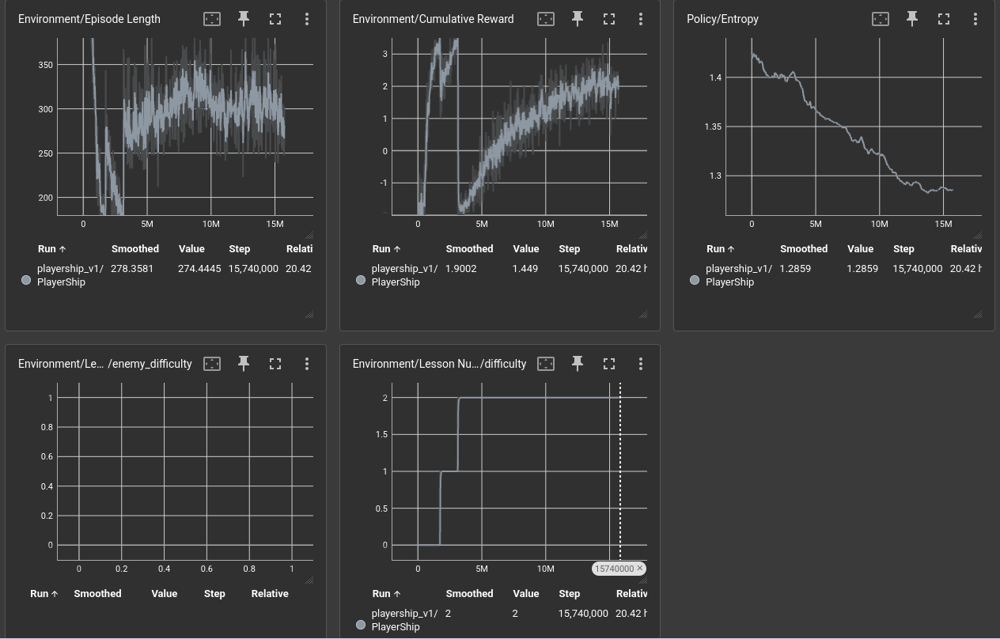
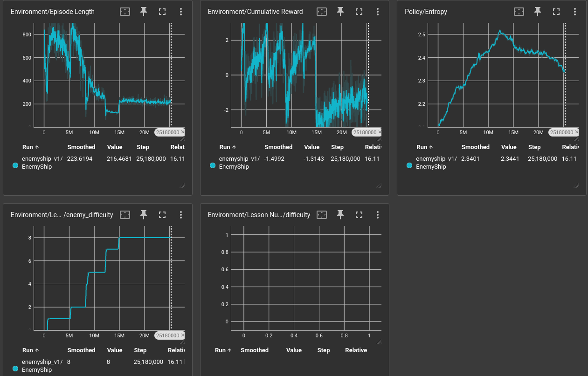
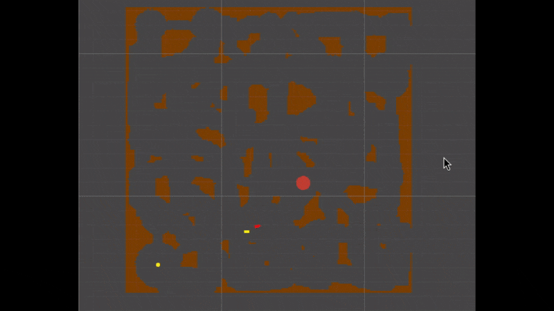

# 2D Naval Warfare - Enemy Ship AI

This repository is an attempt to create enemy ship agent in 2d naval game. The agent's goal is to prevent the player from reaching the target point by colliding with it or firing a mine in a precedural generated enviroment.

### Training Pipeline

Since we have walls in our game, we need to teach agents to navigate first. For that I used curriculum learning with some dense reward shaping. Also, in order to train the enemy, we first need decent player. So our initial goal is the train the player.

Below is a quick recap. See config files for curriculums.

#### Player Observations - 41

| Input              | Min | Max |
| ------------------ | --- | --- |
| shipForwardVel     | 0   | 1   |
| shipSidewaysVel    | 0   | 1   |
| ray0               | 0   | 1   |
| ray1               | 0   | 1   |
| ray2               | 0   | 1   |
| ray3               | 0   | 1   |
| ray4               | 0   | 1   |
| ray5               | 0   | 1   |
| ray6               | 0   | 1   |
| ray7               | 0   | 1   |
| ray8               | 0   | 1   |
| ray9               | 0   | 1   |
| ray10              | 0   | 1   |
| ray11              | 0   | 1   |
| ray12              | 0   | 1   |
| ray13              | 0   | 1   |
| ray14              | 0   | 1   |
| ray15              | 0   | 1   |
| enemy1Exists       | 0   | 1   |
| enemy1Distance     | 0   | 1   |
| enemy1DirX         | -1  | 1   |
| enemy1DirY         | -1  | 1   |
| enemy1ClosingSpeed | -1  | 1   |
| enemy2Exists       | 0   | 1   |
| enemy2Distance     | 0   | 1   |
| enemy2DirX         | -1  | 1   |
| enemy2DirY         | -1  | 1   |
| enemy2ClosingSpeed | -1  | 1   |
| mine1Exists        | 0   | 1   |
| mine1Distance      | 0   | 1   |
| mine1DirX          | -1  | 1   |
| mine1DirY          | -1  | 1   |
| mine1TTE           | 0   | 1   |
| mine2Exists        | 0   | 1   |
| mine2Distance      | 0   | 1   |
| mine2DirX          | -1  | 1   |
| mine2DirY          | -1  | 1   |
| mine2TTE           | 0   | 1   |
| targetDistance     | 0   | 1   |
| targetDirX         | -1  | 1   |
| targetDirY         | -1  | 1   |


#### Enemy Observations - 28

| Input           | Min | Max |
| --------------- | --- | --- |
| shipForwardVel  | 0   | 1   |
| shipSidewaysVel | 0   | 1   |
| ray0            | 0   | 1   |
| ray1            | 0   | 1   |
| ray2            | 0   | 1   |
| ray3            | 0   | 1   |
| ray4            | 0   | 1   |
| ray5            | 0   | 1   |
| ray6            | 0   | 1   |
| ray7            | 0   | 1   |
| ray8            | 0   | 1   |
| ray9            | 0   | 1   |
| ray10           | 0   | 1   |
| ray11           | 0   | 1   |
| ray12           | 0   | 1   |
| ray13           | 0   | 1   |
| ray14           | 0   | 1   |
| ray15           | 0   | 1   |
| mineAmmoCount   | 0   | 1   |
| mineCooldown    | 0   | 1   |
| playerDirX      | -1  | 1   |
| playerDirY      | -1  | 1   |
| playerDistance  | 0   | 1   |
| targetDirX      | -1  | 1   |
| targetDirY      | -1  | 1   |
| targetDistance  | 0   | 1   |
| relativeVelX    | -1  | 1   |
| relativeVelY    | -1  | 1   |


#### Phase 0

We need decent player first.

- I freeze the enemies - but still can fire mines (shouldn't matter tho since enemies outputs are just random).
- Dense shaping based on how much the agent gets closer to the target compare to last step
- Dense shaping based on how close to the closest mine - accounting time to explotion  
- Dense shaping based on how close to the closest enemy
- On death -1
- Reaching target +5 
- -0.001f as step penalty

Assign the `Models/dummyEnemy` model to enemy prefab and make behaviour type inference only. Set player behaviour type to default and get a build for training scene. Then inside `pythonEnv`

```
mlagents-learn config/playerOnly.yaml --env=yourpath.x86_64 --run-id=playerShip_v1 --time-scale=40
```

Here is the results:



It can consistently reach the target.

#### Phase 1 

Now we can train enemy ship.

Note: I tried to use radar for enemies and not giving the target information because I thought that would make them cheat but without that I couldn't manage to teach the enemies.

Note2: I also try some crazy dense shaping which most of it worked but it felt like overshaping and I thought it will make enemies not capable of learning new strategies so I removed most of them.
Overshaped version trained on 2 enemies vs 1 player. See in [overshaped](https://github.com/saliherdemk/NavalAITrain/tree/overshaped) branch with demo video.

- Curriculum for enemies: Small map - Slow player and variants of those (see `enemyOnly.yaml`)
- Dense shaping based on difference between player and the target
- -5 on death
- +1.5 on player death by hittin walls
- +5 on player death by hitting mines
- +5 for colliding with player
- +3 on timeout but only player couldn't make progress enough
- -5 for player reaches the target
- -0.0001f as step penalty


Set playerShip_v1 to player and set behaviour type to inference. Set enemyShip behaviour type to default and get a build for training scene.

```
 mlagents-learn config/enemyOnly.yaml --env=Builds/yourpath/game.x86_64 --run-id=enemyShip_v1 --time-scale=40
```



Enemy is not optimal in the hardest difficulty. I believe this is because our game is not that balanced. Working on the `v2` branch.




I also tried self-play with no success. Will try again.
